## Part 1. Installation of the OS
* Ubuntu version using "cat /etc/issue" coomand
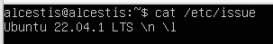
## Part 2. Creating a user
* Creating new user using `#ffffff "useradd"` command
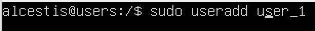
* User is in a group adm
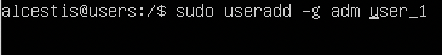
## Part 3. Setting up the OS network
* Creating user user_1
![Part_3]
* Correct timezone for my region
![Part_3_2]
* Names of the neetwork interfaces
lo interface is a virtual interface present by default on any Linux. It is used to debug network programs and run server applications on the local machine.
![Part_3_3]
* Ip address of the device I`m working in from DHCP server
![Part_3_4]
* External Ip of the gateway(ip)
![Part_3_5]
* Internal IP address of the gateway, aka default ip address (gw)
![Part_3_6]
* Manually set ip, gw, dns settings
![Part_3_7]
* Ping 1.1.1.1 and ya.ru remote hosts
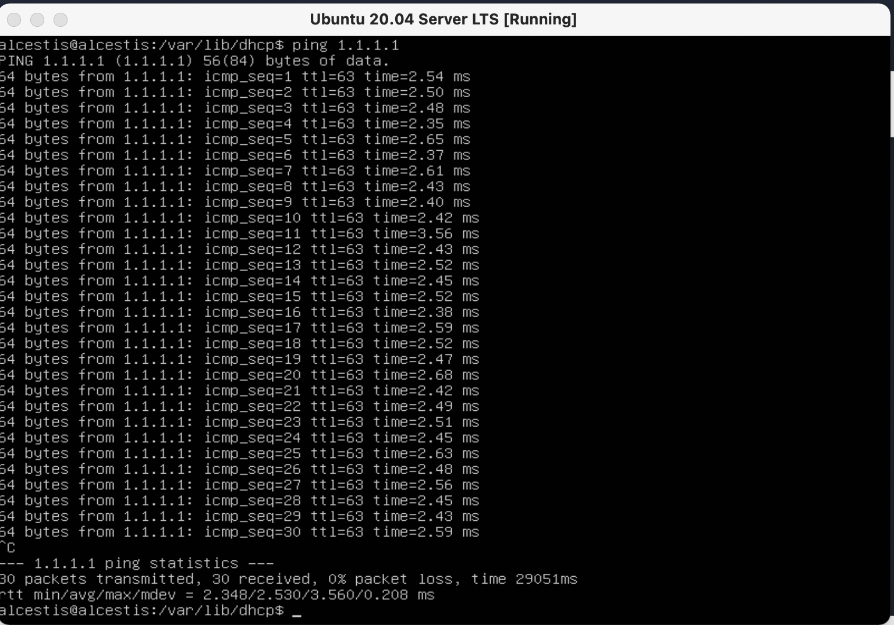
## Part 4. OS Update
* All packages updated to the latest version
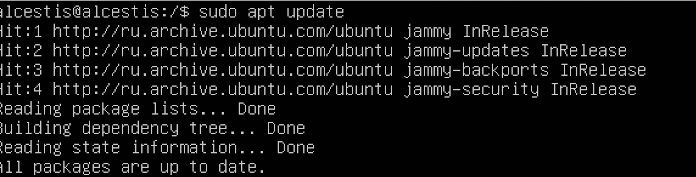
## Part 5. Using the sudo command
* Useradded to sudo group
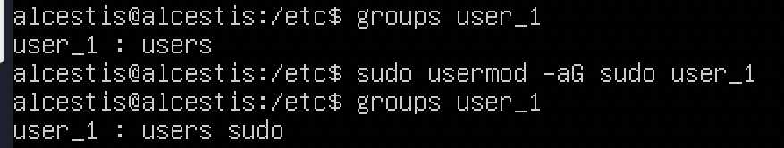
* Hostaname changed using "sudo nano /etc/hostname" command
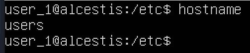
## Part 6. Installing and configuring the time service
* Automatic time synchronisation service setup

* NTPS synchronization
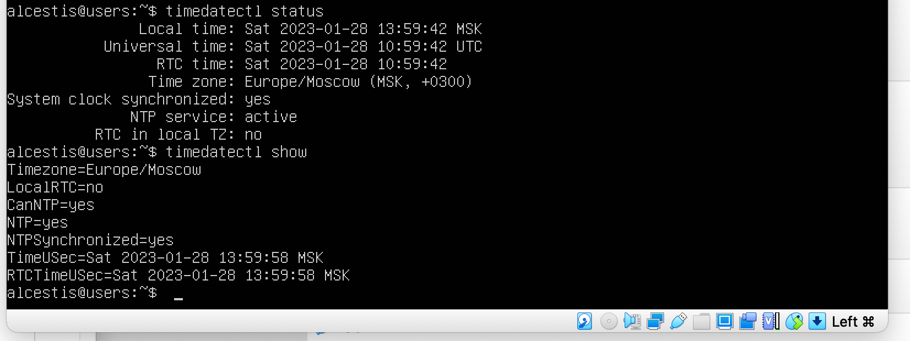
## Part 7. Installing and using text editors
* VIM usage:
- Create with saving the changes (:wq)
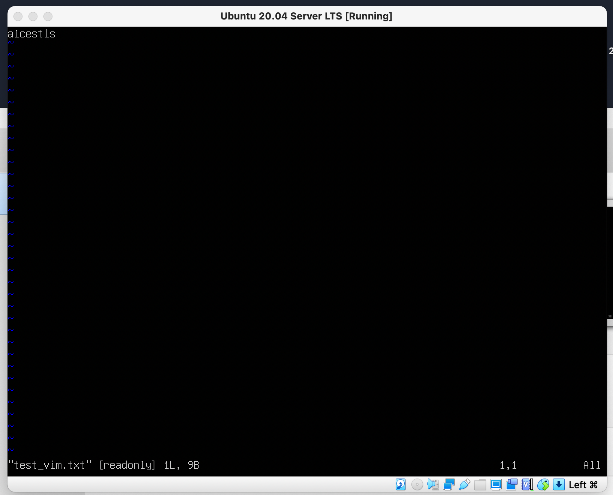
- Update without saving (:q!)

- Search(:/)
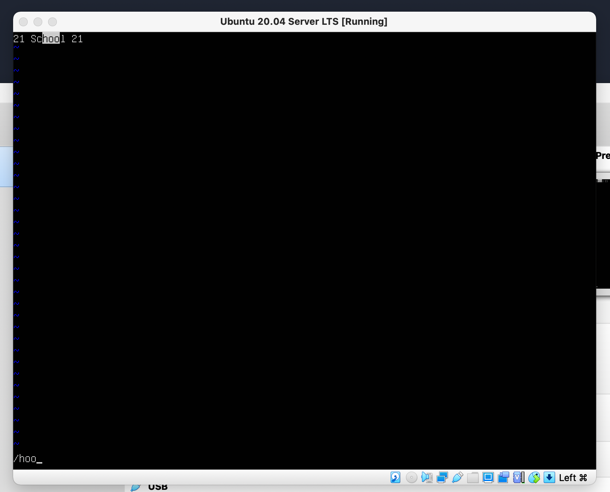
- Search and Replace(:s/search str/replace str)
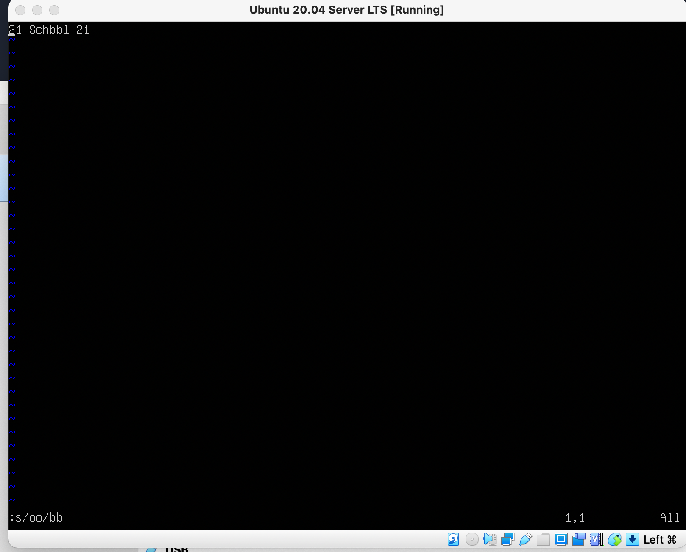
* NANO usage:
- Create with saving the changes (^X+Y)
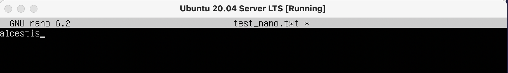
- Update without saving (^X+N)
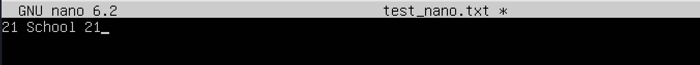
- Search(^X)

- Replace(^R)
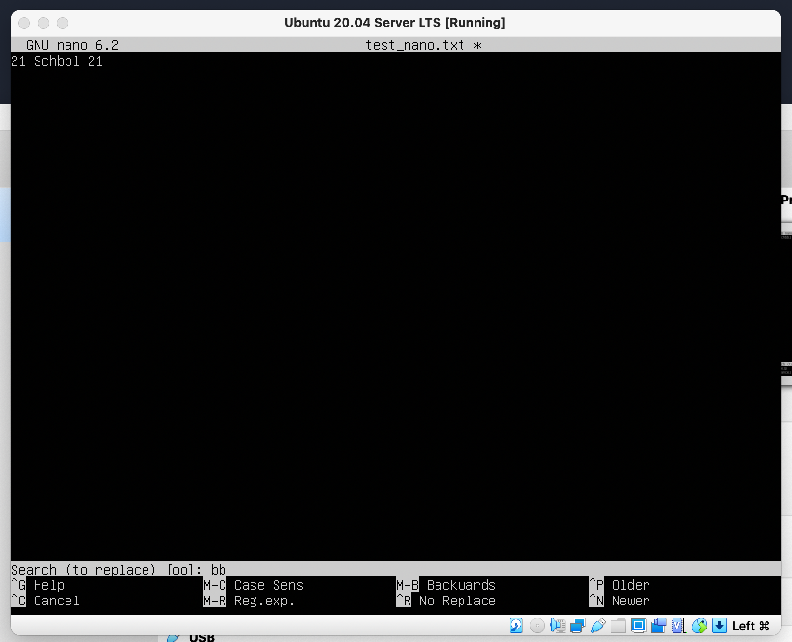
* MCEDIT usage:
- Create with saving the changes (F2)
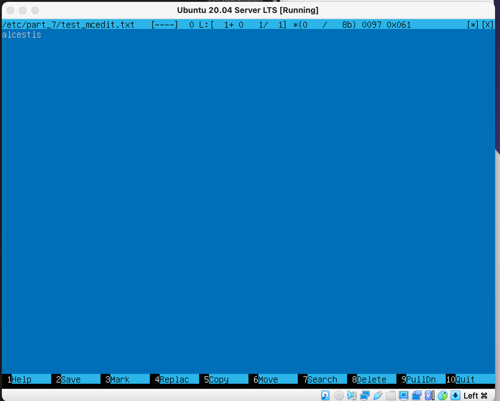
- Update without saving (F10)
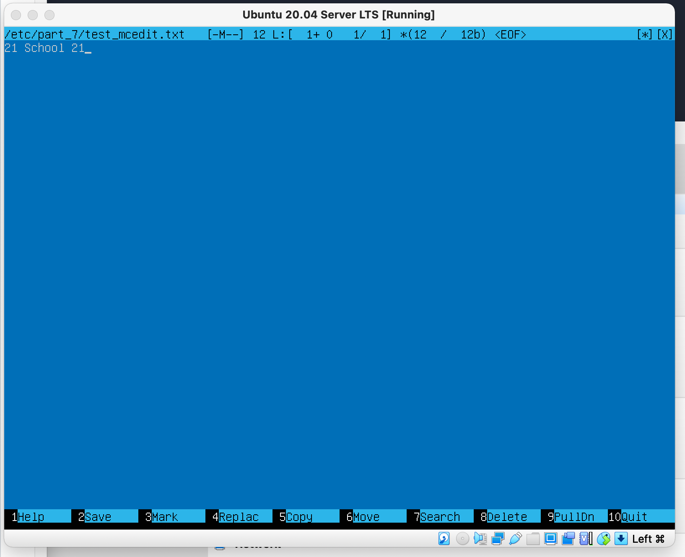
- Search(F7)
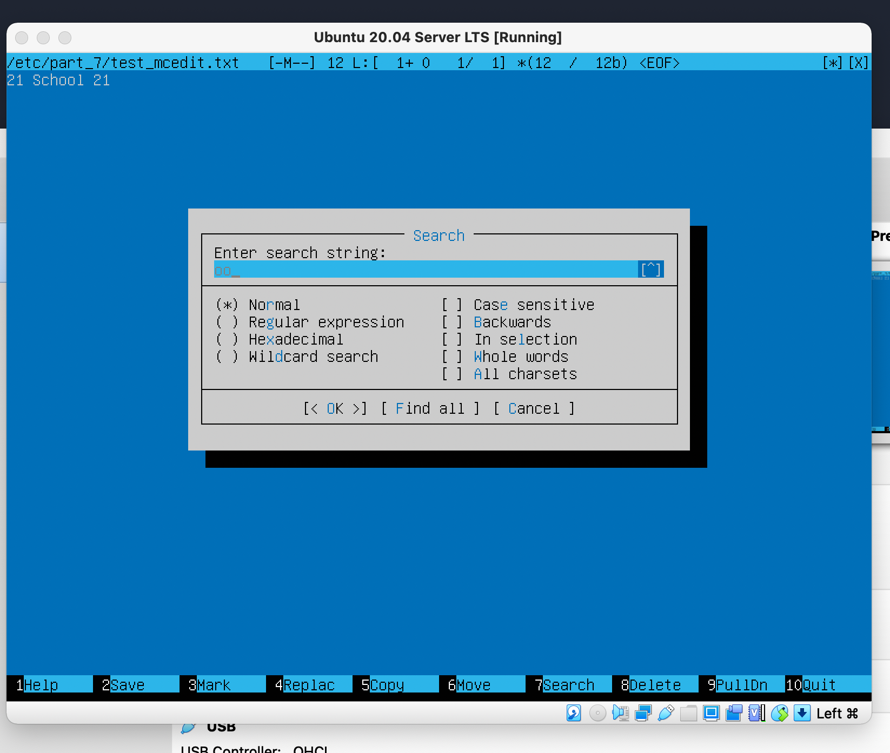
- Search and Replace(F4)
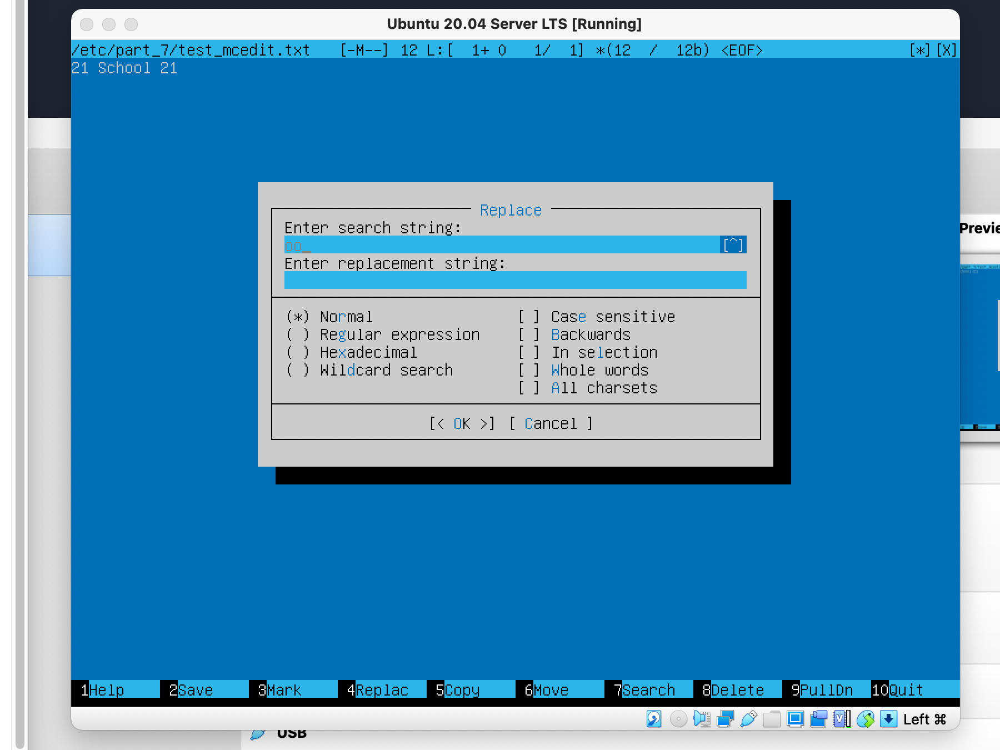
## Part 8. Installing and basic setup of the SSHD service
* Install the SSHd service "sudo apt install openssh-server"
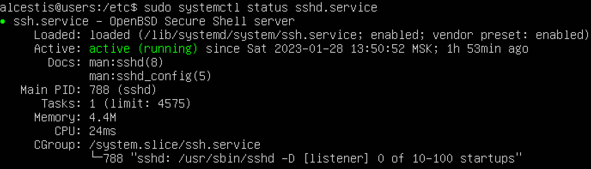
* Auto-start of the service whenever the system boots added

* Reset the SSHd service to port 2022

* Sshd process using the ps command

* Netstat -tan command
-t - filter TCP protocol
-a - all ports
-n - shows ip instead of host, port number instead of name, UID instead of username.
Table explained:
The "Proto" column tells us whether the specified socket is TCP or UDP. These are network protocols.
The "Recv-Q" and "Send-Q" columns tell us how much data is queued for this socket, waiting to be read (Recv-Q) or sent (Send-Q).
The "Local Address" and "External Address" columns tell you which hosts and ports the listed sockets are connected to. The local end is always on the computer on which you run netstat (in the example, the computer is called "Trafalgar"), and the external end is on another computer (may be somewhere on the local network or somewhere on the Internet).
The Status column tells you what state the listed sockets are in. The TCP protocol defines states, including "LISTENING" (wait for some external computer to contact us)
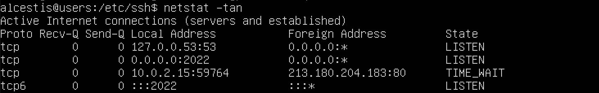
## Part 9. Installing and using the top, htop utilities

 