## Part 1. Installation of the OS
* Ubuntu version using `"cat /etc/issue"` coomand

---
## Part 2. Creating a user
* Creating new user using `"useradd"` command

* User is in a group adm

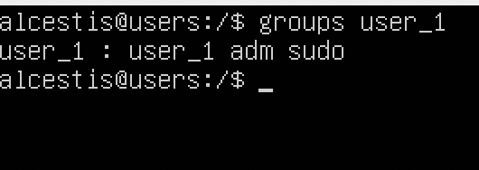
---
## Part 3. Setting up the OS network
* Correct timezone for my region
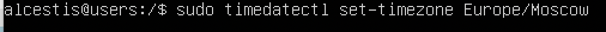
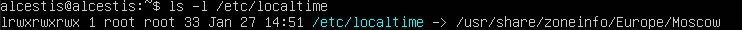
* Names of the neetwork interfaces
lo interface is a virtual interface present by default on any Linux. It is used to debug network programs and run server applications on the local machine.
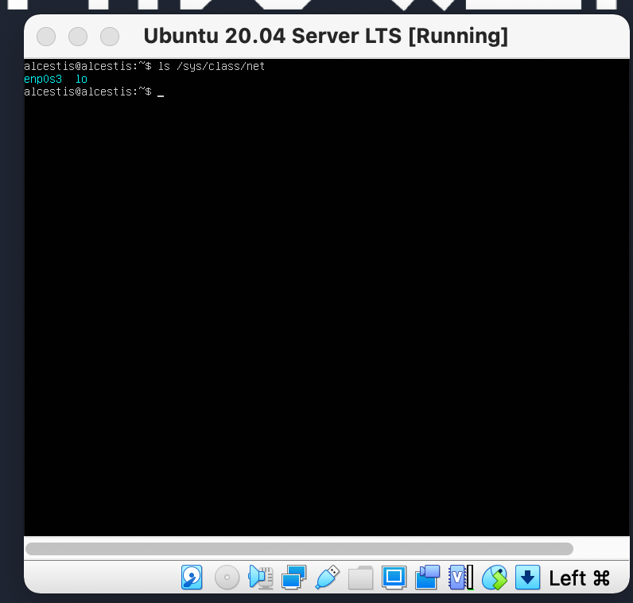
* Ip address of the device I`m working in from DHCP server
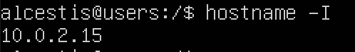
* External Ip of the gateway(ip)
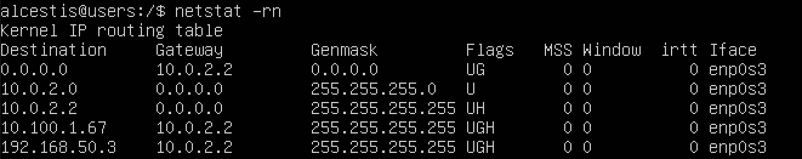
* Internal IP address of the gateway, aka default ip address (gw)
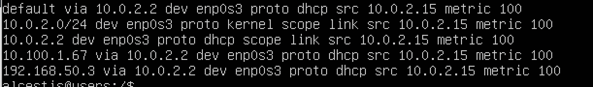
* Manually set ip, gw, dns settings using `sudo vim /etc/netplan/00-installer-config.yaml`
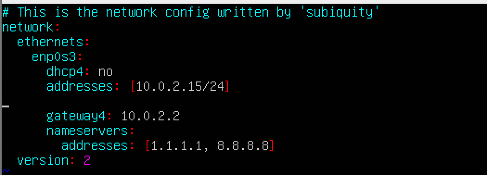

* Ping 1.1.1.1 and ya.ru remote hosts

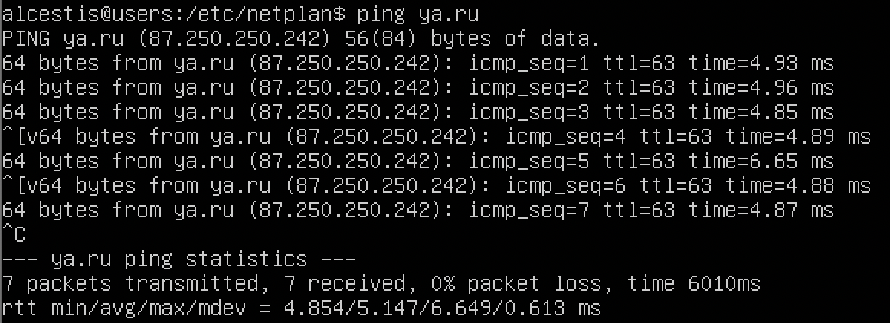
---
## Part 4. OS Update
* All packages updated to the latest version

---
## Part 5. Using the sudo command
* Useradded to sudo group

* Hostaname changed using `"sudo nano /etc/hostname"` command

---
## Part 6. Installing and configuring the time service
* Automatic time synchronisation service setup
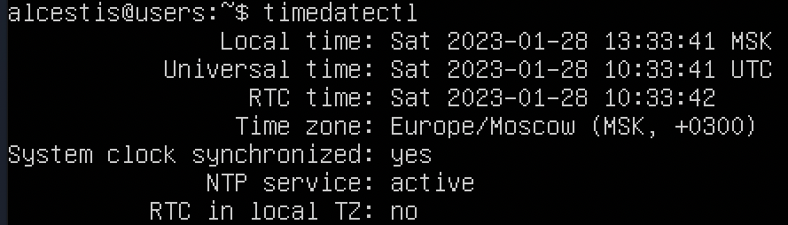
* NTPS synchronization

---
## Part 7. Installing and using text editors
### VIM usage:
- Create with saving the changes `:wq`

- Update without saving `:q!`

- Search `:/`

- Search and Replace`:s/search str/replace str`

### NANO usage:
- Create with saving the changes `^X+Y`

- Update without saving `^X+N`

- Search `^X`

- Replace`^R`

### MCEDIT usage:
- Create with saving the changes `F2`

- Update without saving `F10`

- Search `F7`

- Search and Replace `F4`

---
## Part 8. Installing and basic setup of the SSHD service
* Install the SSHd service `"sudo apt install openssh-server"`

* Auto-start of the service whenever the system boots added

* Reset the SSHd service to port 2022

* Sshd process using the `ps` command. `ps -e` command writes information to standard output about all processes, except kernel processes.

### `Netstat -tan` command
#### Keys explaned:
* -t - filter TCP protocol
* -a - all ports
* -n - shows ip instead of host, port number instead of name, UID instead of username.
#### Table explained:
* The `"Proto"` column tells us whether the specified socket is TCP or UDP. These are network protocols.
* The `"Recv-Q"` and `"Send-Q"` columns tell us how much data is queued for this socket, waiting to be read (Recv-Q) or sent (Send-Q).
* The `"Local Address"` and "External Address" columns tell you which hosts and ports the listed sockets are connected to. The local end is always on the computer on which you run netstat (in the example, the computer is called "Trafalgar"), and the external end is on another computer (may be somewhere on the local network or somewhere on the Internet).
* The `Status column` tells you what state the listed sockets are in. The TCP protocol defines states, including "LISTENING" (wait for some external computer to contact us)
#### 0.0.0.0 explained:
* Foreign address 0.0.0.0 - no one connected
* Local address 0.0.0.0 - listening on all interfaces 

---
## Part 9. Installing and using the top, htop utilities
### `top` command:
* uptime - 2:34
* number of authorised users - 1
* total system load - 0.00
* total number of processes - 97
* cpu load - 0.0 us
* memory load - 3924.3
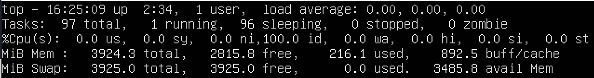
* pid of the process with the highest memory usage - 1306, 781
* pid of the process taking the most CPU time - 3454

### `htop` command:
* sorted by PID
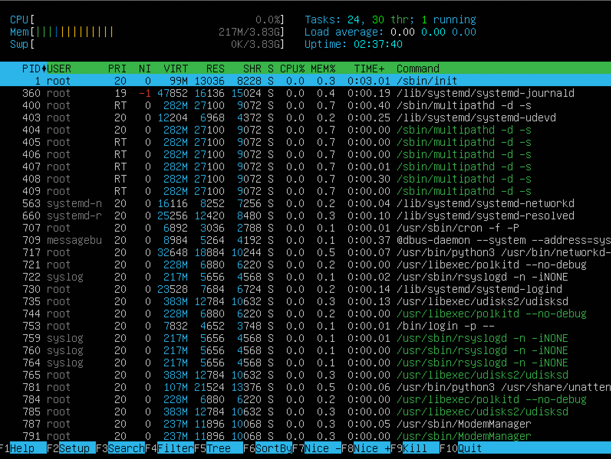
* sorted by PERCENT_CPU
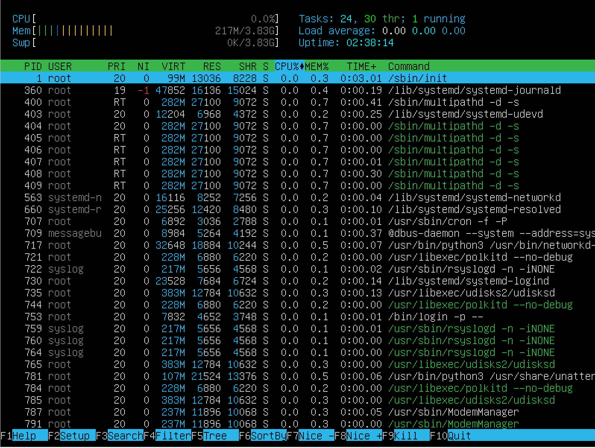
* sorted by PERCENT_MEM
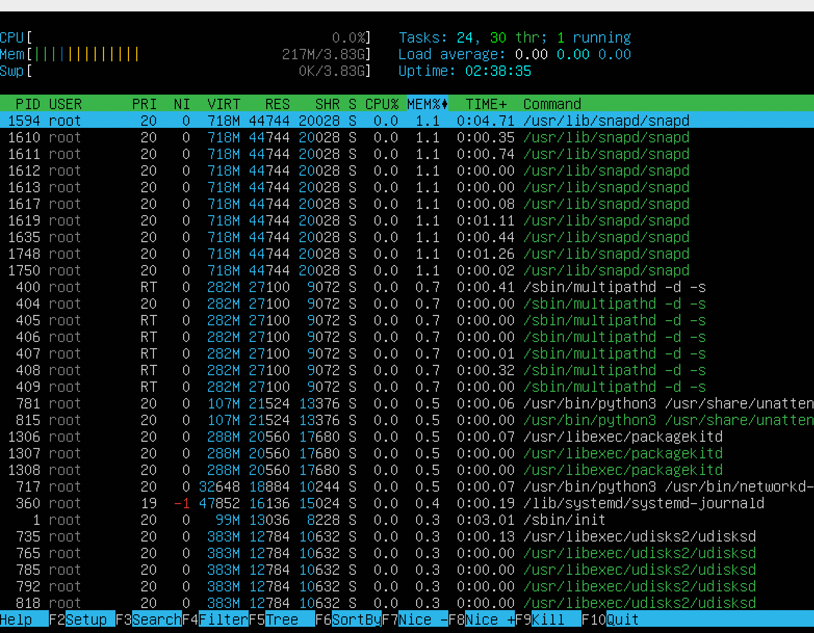
* sorted by TIME
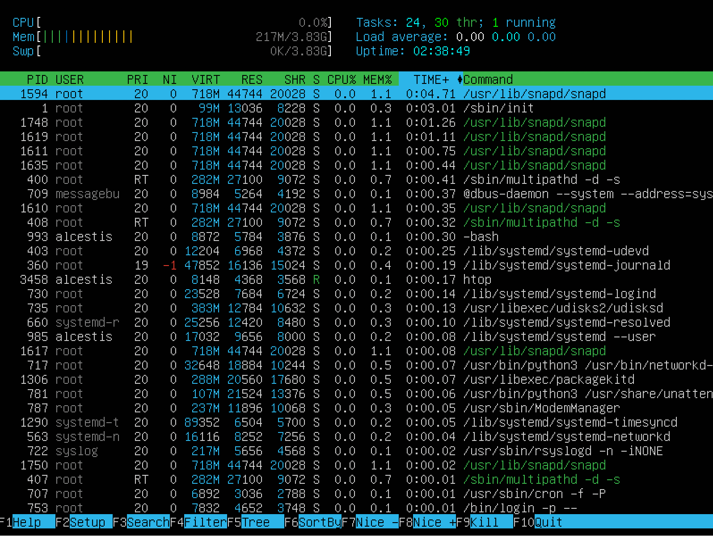
* filtered for sshd process
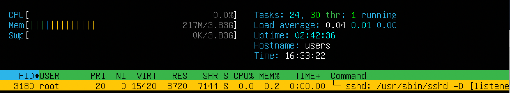
* with the syslog process found by searching
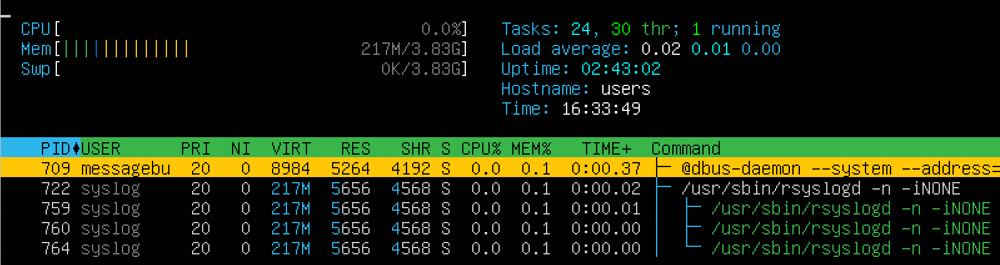
* with hostname, clock and uptime output added
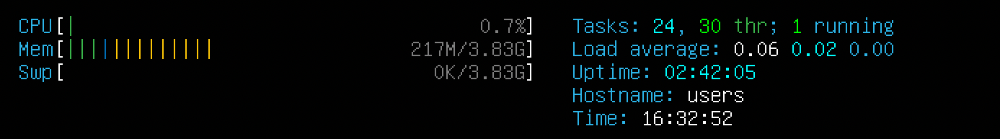
---
## Part 10. Using the fdisk utility
* Running `fdisk -l` command
name of the hard disk  - /sda
capacity - 40G
number of sectors - 83886080
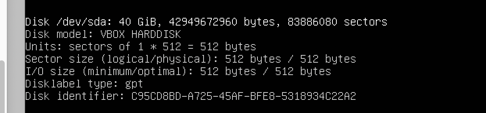
---
## Part 11. Using the df utility
### Running `df` command for the root partition(/):
* kB - kilobyte
* partition size  - 40970464kB
* space used - 7215408kB
* space free - 3164167kB
* percentage used - 19%
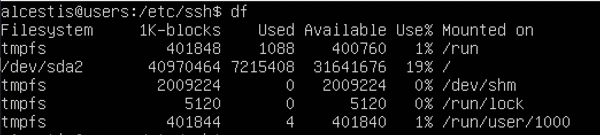
### Running `df -Th` command for the root partition(/):
* file system type - ext4 aka fourth extended file system
* partition size  -  40G
* space used - 6.9G
* space free - 31G
* percentage used - 19%
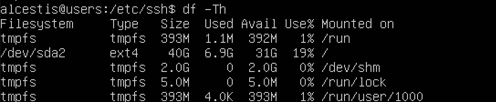
---
## Part 12. Using the du utility
* Running `du` command
#### Output the size of folders:
* /home

* /var
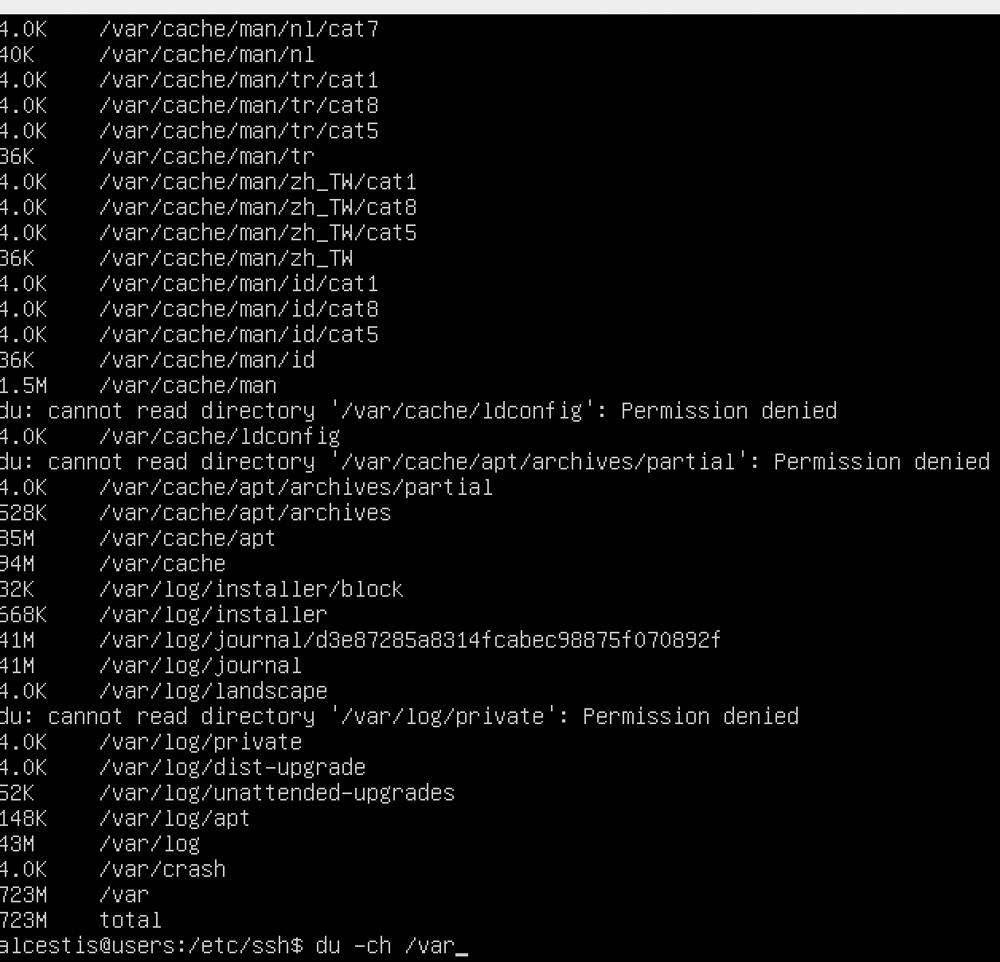
* /var/log

* /var/log (using *)
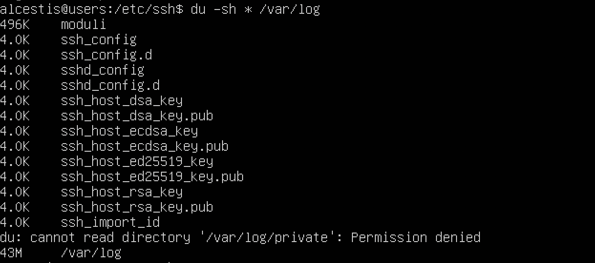
---
## Part 13. Installing and using the ncdu utility
* Installing ncdu utility using `sudo apt install ncdu` command
* Running `ncdu` command
#### Output the size of folders:
* /home
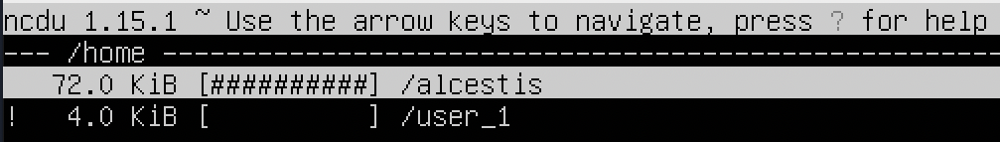
* /var
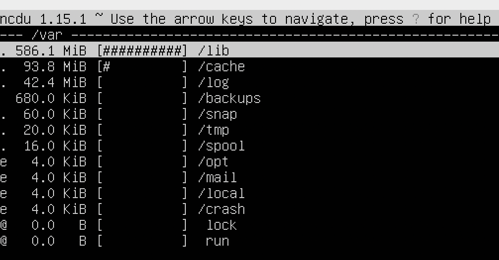
* /var/log
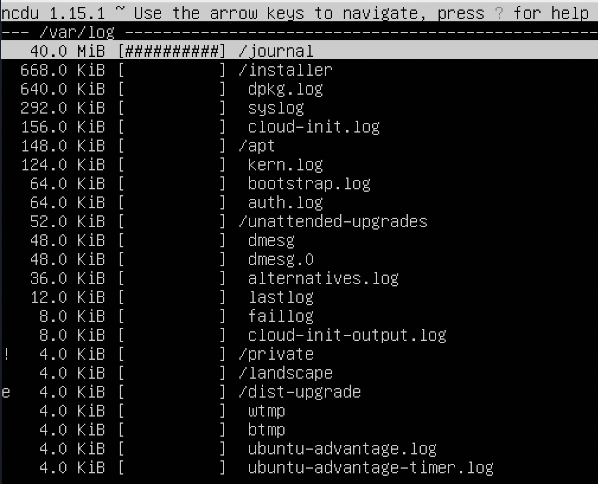
---
## Part 14. Working with system logs
* Open for viewing: /var/log/dmesg, /var/log/syslog, /var/log/auth.log
* The last successful login time - 17:57:57
* User name - alcestis
* Login method - pam-unix
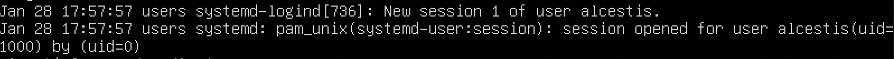
* Restart SSHd service using `sudo systemctl restart ssh.service` command

---
## Part 15. Using the CRON job scheduler
* Using the job scheduler, run the uptime command in every 2 minutes

* Lines in the system logs (at least two within a given time range) about the execution

* A list of current jobs for CRON

* Remove all tasks from the job scheduler
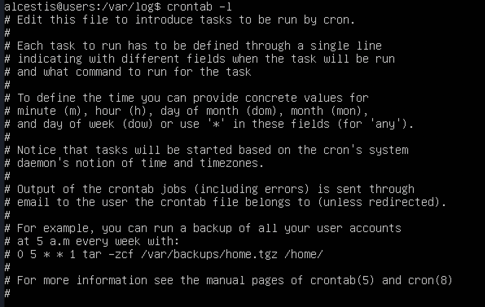
---