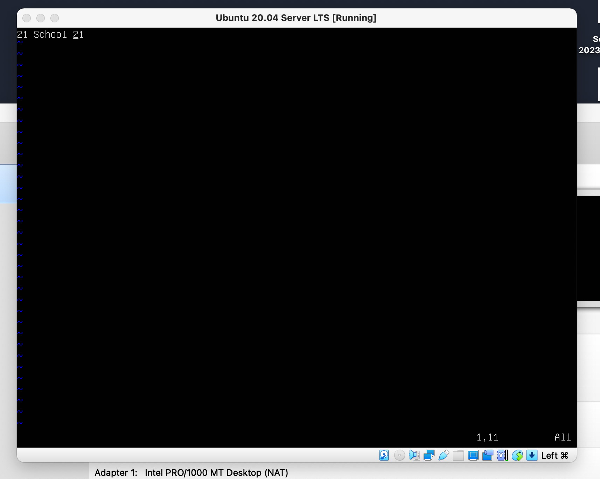

## Part 1. Installation of the OS
* Ubuntu version using `#ffffff` "cat /etc/issue" coomand

## Part 2. Creating a user
* Creating new user using `#ffffff`"useradd" command

* User is in a group adm

## Part 3. Setting up the OS network
* Creating user user_1
![Part_3]
* Correct timezone for my region
![Part_3_2]
* Names of the neetwork interfaces
lo interface is a virtual interface present by default on any Linux. It is used to debug network programs and run server applications on the local machine.
![Part_3_3]
* Ip address of the device I`m working in from DHCP server
![Part_3_4]
* External Ip of the gateway(ip)
![Part_3_5]
* Internal IP address of the gateway, aka default ip address (gw)
![Part_3_6]
* Manually set ip, gw, dns settings
![Part_3_7]
* Ping 1.1.1.1 and ya.ru remote hosts

## Part 4. OS Update
* All packages updated to the latest version

## Part 5. Using the sudo command
* Useradded to sudo group

* Hostaname changed using "sudo nano /etc/hostname" command

## Part 6. Installing and configuring the time service
* Automatic time synchronisation service setup

* NTPS synchronization

## Part 7. Installing and using text editors
* VIM usage:
- Create with saving the changes (:wq)

- Update without saving (:q!)

- Search(:/)

- Search and Replace(:s/search str/replace str)

* NANO usage:
- Create with saving the changes (^X+Y)

- Update without saving (^X+N)

- Search(^X)

- Replace(^R)

* MCEDIT usage:
- Create with saving the changes (F2)

- Update without saving (F10)

- Search(F7)

- Search and Replace(F4)

 